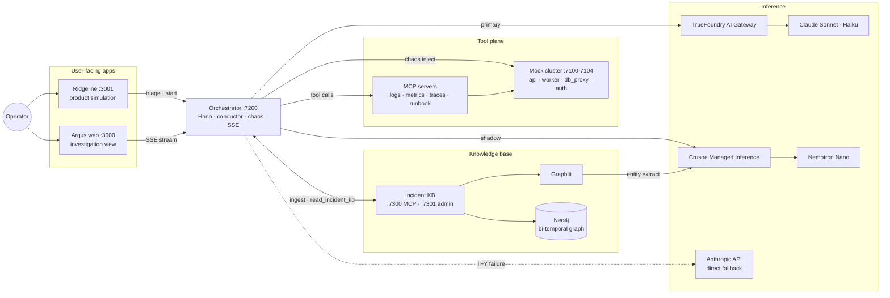

# Argus

**A dual-cognition autonomous SRE agent that survives the infrastructure chaos it investigates.**

Argus watches production for an on-call operator, reasons across two independent LLM "minds" running the same incident in parallel, and routes around its own dependencies when they fail. Every resolved investigation is written back to a knowledge graph, so each incident makes the next one smarter.

Built for the DevNetwork AI+ML Hackathon 2026.

---

## What it does

- **Dual-cognition resilience.** Two models (Claude as primary, Nemotron as shadow) execute the investigation in lockstep through TrueFoundry's AI Gateway. When the primary degrades, the shadow takes over with no context loss. When they disagree, that divergence is itself a hallucination signal.
- **Incident Knowledge Base.** Every resolved investigation is ingested into a bi-temporal knowledge graph (Neo4j + Graphiti). On the next incident, Argus retrieves past cases sharing services, symptoms, or root causes, then verifies them against live signals before trusting them.
- **Product-embedded triggers.** Ridgeline, a fictional data-pipeline platform, simulates real product surfaces that go into distress. An embedded Argus launcher detects the fault and streams in a live first-pass triage (a Claude Haiku call through the gateway) before deep-linking into the full investigation. Faults across surfaces stack as separate alerts, and the operator never leaves their product context.

## Architecture

| Component | Port | Stack |
|-----------|------|-------|
| Argus web (investigation view) | `:3000` | Next.js 16, React 19, Tailwind v4 |
| Ridgeline (product simulation) | `:3001` | Next.js 16, React 19 |
| Orchestrator | `:7200` | Hono, Node.js |
| Mock cluster (api / worker / db_proxy / auth) | `:7100–7104` | FastAPI, Python |
| Incident KB | `:7300` (MCP) / `:7301` (admin) | FastAPI, Neo4j, Graphiti |
| Neo4j | `:7474` / `:7687` | Docker |

The orchestrator drives a dual-cognition conductor over the TrueFoundry AI Gateway (with automatic direct-mode fallback), manages incident lifecycle and chaos injection, and exposes triage + KB endpoints. MCP servers wrap the mock observability stack (logs / metrics / traces / runbook / incident-kb), each with retry, circuit breaker, and synthetic-response fallback.



```
apps/
  orchestrator/   Hono server: conductor, incident lifecycle, chaos, triage, KB ingest
  web/            Argus investigation view
  ridgeline/      Product simulation with embedded Argus triggers
mcp/              MCP servers for the mock observability stack + runbooks
services/
  mock-cluster/   FastAPI service cluster with chaos injection endpoints
  incident-kb/    FastAPI + Neo4j + Graphiti knowledge base (MCP + admin API)
scripts/          KB seed / reset
docs/             Specs, plans, demo scripts, Devpost submission
```

## Getting started

### Prerequisites

- Node 22+ and [pnpm](https://pnpm.io) 9 (this is a pnpm workspace — use `pnpm`, not `npm`)
- [uv](https://docs.astral.sh/uv/) for the Python services
- Docker (for Neo4j)

### Setup

```bash
pnpm install
cp .env.example .env.local   # fill in API keys
```

Required keys in `.env.local`:

- `TRUEFOUNDRY_API_KEY` — AI Gateway routing for the conductor (Claude Sonnet primary, Haiku triage). Also the configurable backup for KB extraction (`GRAPHITI_LLM_PROVIDER=tfy`).
- `ANTHROPIC_API_KEY` — direct-mode fallback if the TFY gateway is down.
- `CRUSOE_API_KEY` — Crusoe Cloud Managed Inference. Hosts the Nemotron Nano shadow cognition **and** drives Graphiti's KB extraction + rerank (primary, ~60s per live incident).
- Neo4j defaults (`bolt://localhost:7687`, `neo4j` / `devpass`) work out of the box with the bundled Docker compose.

### Run the stack

Start each in its own terminal:

```bash
pnpm dev:neo4j       # graph store        :7474 / :7687
pnpm dev:cluster     # mock cluster       :7100-7104
pnpm dev:kb          # incident KB        :7300 (mcp) / :7301 (admin)
pnpm dev:orch        # orchestrator       :7200
pnpm dev:web         # Argus web          :3000
pnpm dev:ridgeline   # Ridgeline sim      :3001
```

Wait for `Uvicorn running on http://0.0.0.0:7301` (KB) and `[argus] incident-kb mcp connected` (orchestrator) before driving a demo.

### Seed the knowledge base

```bash
pnpm seed-kb     # ingest 12 historic incidents
pnpm reset-kb    # wipe the graph
```

Seeding is rate-limited by the extraction provider and runs offline once — never seed live during a demo.

## Demo scenarios

Six incident scenarios, each with a Ridgeline product surface that goes into distress and triggers the embedded Argus launcher:

| Surface | Route | Scenario | Time to fault |
|---------|-------|----------|---------------|
| Overview | `/` | — (healthy dashboard) | — |
| Sign In | `/login` | auth-5xx (503 storm) | ~700ms |
| Query Studio | `/query` | db-saturation (pool exhaust) | ~2.5s |
| Batch Jobs | `/jobs` | worker-oom (heap climb) | ~6s |
| Dashboard | `/app` | api-brownout (panels stall) | ~3s |
| Connections | `/connections` | db-timeout (rows time out) | ~4s |
| Deploys | `/deploys` | api-config-drift (rev goes live → 503 spike) | ~3s |

Ridgeline surface timers are page-scoped: navigate away before the fault fires and the timer dies. After the fault appears, there is a deliberate ~1.2s beat before the Argus alert flares so the operator can register the failure on the product before the AI reacts. Full demo walkthroughs live in [`docs/demos/`](docs/demos/).

### Demo resilience details

- **Mid-flight chaos abort.** Kill-provider in the chaos panel aborts any in-flight LLM call on that provider; failover kicks in within the current step, not after it finishes. The chaos state automatically clears on `incident_done` so a killed primary doesn't leak into the next run.
- **Bounded investigations.** The conductor caps at 14 steps with a final-step nudge that forces a partial-conclusion report — investigations resolve consistently rather than ending in an "incomplete" state.
- **Live ingest progress.** While Graphiti is extracting entities for a resolved incident, the case-graph panel polls `/admin/ingest/status/{id}` and shows a live counter (extractions + elapsed) instead of a generic "seeding" spinner. A `↻` button next to the fullscreen toggle re-polls on demand.

## Built with

Next.js 16, React 19, Hono, TrueFoundry AI Gateway, Crusoe Cloud Managed Inference, Nemotron, Claude, Model Context Protocol, Neo4j, Graphiti, FastAPI, TypeScript, Tailwind CSS, Python.

## Project docs

- [`PRODUCT.md`](PRODUCT.md) — product vision, brand, and design principles
- [`docs/DEVPOST.md`](docs/DEVPOST.md) — hackathon submission
- [`docs/`](docs/) — specs, plans, and demo scripts
